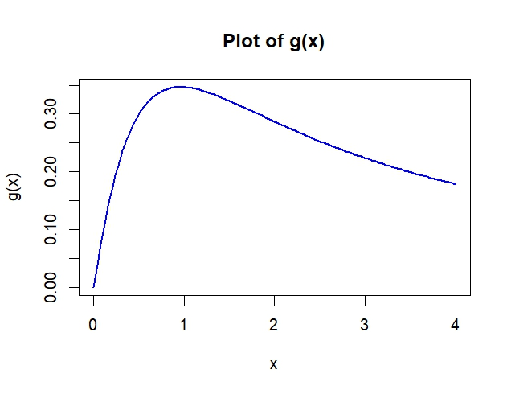

```{r setup, include=FALSE}
knitr::opts_chunk$set(echo = TRUE)
knitr::opts_chunk$set(size = "small")
```

# Introduction

Implementation of 2 Assignment questions of Computational Statistics Lab 1 .

# Contributions

Member: Dhanush Kumar Reddy Narayana Reddy, Liu Id: dhana004, Contribution: Report writing and coding of question 1.

Member: Udaya Shanker Mohanan Nair, Liu Id: udamo524, Contribution: Report writing and coding of question 2.

# Question 1

## Question 1: Maximization of a function in one variable

$$
g(x) = \frac{\log(x + 1)}{x^{3/2} + 1}
$$

## Part A

```{r, echo=FALSE}

```

Based on the behavior of the function and the typical shape of similar functions,I would guess the maximum point to be near My guess x = 0.63

## Part B

```{r, echo=FALSE}
knitr::include_graphics("lab1_partB.jpeg")
```


## Part C

### Bisection method 

The Root by the Bisection Method is:
\[
\text{Root: } 0.9610605
\]
Number of iterations is:

\[
\text{Iterations: } 21
\]

For Bisection Method, given the interval [0,4] the bisection method converges to the root 0.9610605 in 21 iterations.

## Part D

### Secant Method 

The Root found by the Secant Method is:
\[
\text{Root: } 161850630762
\]
Number of iterations is:
\[
\text{Iterations: } 100
\]
  
For Secant Method, given the interval [0,4] the bisection method converges to the root 161850630762 in 100 iterations.

## Part E

Bisection: 
 Root:  0.9610603 
 Iterations:  21 

Secant: 
 Root:  142731864020 
 Iterations:  100 
 
Bisection Method: Given the interval [0.75,3] the bisection method converges to the root 0.9610603 in 21 iterations.
 
Secant Method: Given the initial guesses 0.75 and 3, the secant method produces an incorrect root 142731864020 in 100 iterations.

The secant method's failure to converge in this case is likely due to poor initial guesses or the nature of the function g′ near the root. It suggests the secant method can sometimes be less reliable than the bisection method for finding roots, especially if the initial guesses are not well chosen.

### Part F

Bisection method:  Bisection is usually preferred for its simplicity and guaranteed convergence within an interval where a sign change occurs. Suitable for well-behaved functions over an interval.

Secant method: Secant is used when you have good initial guesses and need faster convergence. Useful when dealing with more complex functions where derivative information is unreliable.

It's often based on to the function's nature and the problem context. If you prefer simplicity, it is better to go with Bisection. When speed and efficiency matter more than simplicity, and you trust your initial guesses, then Secant method is more suitable.

# Question 2

## part a
Implemented a function **myvar**, which accepts a single parameter, a vector for which we need to find variance using the given below formula and returns variance.
\[
\text{Var}(\bar{x}) = \frac{1}{n-1} \left( \frac{1}{n} \sum_{i=1}^n x_i^2 - \left( \frac{1}{n} \sum_{i=1}^n x_i \right)^2 \right)
\]

```{r, echo=FALSE, eval=TRUE}
myvar <- function(x) {
  n <- length(x)
  var1 <- sum(x^2)
  var2 <- sum(x)
  variance <- ((1/(n-1)) * (var1 - ((1/n) * (var2)^2)))
  return(variance)
}
x <- c(1,2,3,4,5,6,7,8,9,1)
cat("Choosen vector x : ",x)
variance <- myvar(x)
cat("Variance for given x is ",variance)
```

## part b
Generated  a vector x containing 10000 random number with mean 10^8 and variance 1.

```{r, echo=FALSE, eval=TRUE}
set.seed(123456)
rm_vec = rnorm(n = 10000, mean = 10^8, sd = 1)
print("Summary of the generated vector")
summary(rm_vec)
```

## part c
Now creating multiple subsets of increasing length and computing the variance using of each subset using myvar function and in-built functionality Var in R. Then estimating the differences in two values for each subset.

```{r, echo=FALSE, eval=TRUE}
y <- numeric(length(rm_vec))
for (i in 1:length(rm_vec)) {
  Xi <- rm_vec[1:i]
  y[i] <- myvar(Xi) - var(Xi)
}
```

Now plotting this differences of variance of each subset against the number of items in each subset.

```{r, echo=FALSE, eval=TRUE}
plot(1:length(rm_vec), y, type = "l", col = "blue", lwd = 2,
     xlab = "Subset size", ylab = "Difference",
     main = "Difference between myvar and var for subsets of Xi")
```

**Conclusions of Plot**

- Difference of variance of each subset oscillates around zero, which ranges between -60 and 60.
- From plot it is clear that new function is almost accurate but not precise in some cases.
- There is no trend that can be jotted from the plot, since the fluctuations for different cases varies     towards negative side and positive side.
- Difference value(either positive or negative) seems to be slightly increasing as the number of items in   subset increases.

**How well the function works**

Function performs well for calculating variance, results produced are close to that produced by in-built function **Var** of R. However the difference between the variances increases(both positively as well as negatively) as the size of the set increases. It is recommend for small- purposes like teaching, experimenting etc., but not for high level applications.

## part d

Another approach used to improve myvar function is based on welford's algorithm.                              

**Reference:** https://en.wikipedia.org/wiki/Algorithms_for_calculating_variance\                             

The steps for Welford's algorithm are:

1. Initialize:
   \[
   mean_1 = 0 \quad \text{(Initial Mean)}
   \]
   \[
   standard-deviation_1 = 0 \quad \text{(Initial standard deviation)}
   \]

2. For each data from  \( x_2 \)  to \( x_k \):
    \[
     mean_k = mean_{k-1} + \frac{x_i - mean_{k-1}}{i}
     \]
     \[
     standard-deviation_k = standard-deviation_{k-1} + (x_i - mean_{k-1}) \cdot (x_i - mean_k)
     \]

3. Variance:
   \[
   \text{Var}(x) = \frac{standard-deviation_n}{n-1}
   \]

```{r, echo=FALSE, eval=TRUE}
welford_variance <- function(x) {
  if (length(x) <= 1){
    stop("For calcultions we need alteast two values in dataset")
  }
  mean_value <- 0
  sd <- 0
  for (i in 1:length(x)) {
    d1 <- x[i] - mean_value
    mean_value <- mean_value+(d1/i)
    d2 <- x[i]-mean_value
    sd <- sd + (d1*d2)
  }
  # Bessel's correction,because of this standard deviation is divided by length(x)-1
  variance <- sd / (length(x) - 1)
  return(variance)
}

k <- numeric(length(rm_vec))
#for welford variance calculation we need atleast two data in each subset
for (i in 2:length(rm_vec)) {
  Xi <- rm_vec[1:i]
  k[i] <- welford_variance(Xi) - var(Xi)
}

plot(2:length(rm_vec), k[2:length(rm_vec)], type = "l", col = "blue", lwd = 2,
     xlab = "Subset size (i)", ylab = "Difference",
     main = "Difference between Welford's algorithm and var for subsets of x")
```

From the plot, it is very clear that differences are very close to zero, so this algorithm is very suitable when compared to myvar for calculating variance as the variance is accurate and precise with those values given by var.

# Appendix

## Question 1

```{r, echo=TRUE, eval=FALSE}
# Maximization of a function in one variable
# Given Formula
g <- function(x) {
  log(x + 1) / (x^(3/2) + 1)
}

# Part A
# Loading x and y 
x <- seq(0, 4, length.out = 100)
y <- g(x)

# Plotting the function
plot(x, y, type = "l", col = "blue", lwd = 2, 
     xlab = "x", ylab = "g(x)", main = "Plot of g(x)")
# Based on the behavior of the function and the typical shape of similar functions,
# I would guess the maximum point to be near My guess x = 0.63


# Part B
u <- function(x) {
  log(x + 1)
}
v <- function(x) {
  x^(3/2) + 1
}
u_dash <- function(x) {
  1 / (x + 1)
}
v_dash <- function(x) {
  (3/2) * x^(1/2)
}
g_dash <- function(x) {
  (u_dash(x) * v(x) - u(x) * v_dash(x)) / (v(x))^2
}
y_dash <- g_dash(x)
plot(x, y_dash, type = "l", col = "red", lwd = 2, 
     xlab = "x", ylab = "g'(x)", main = "Plot of g'(x)")
abline(h = 0, col = "black", lwd = 1, lty = 2)


# Part C
# Bisection method
bisection <- function(f, a, b, error = 1e-6, max_iter = 100) {
  if (f(a) * f(b) >= 0) {
    stop("f(a) and f(b) must have opposite signs.")
  }
  iter <- 0
  while ((b - a) / 2 > error && iter < max_iter) {
    c <- (a + b) / 2
    if (f(c) == 0) {
      return(c)
    } else if (f(a) * f(c) < 0) {
      b <- c
    } else {
      a <- c
    }
    iter <- iter + 1
  }
  list(root = (a + b) / 2, iterations = iter)
}
print(bisection(g_dash, 0, 4)) 
# $root
# [1] 0.9610605
# 
# $iterations
# [1] 21


# Part D
# Secant Method
secant <- function(f, x0, x1, error =1e-6, max_iter = 100) {
  iter <- 0
  while (abs(x1 - x0) > error && iter < max_iter) {
    x2 <- x1 - f(x1) * (x1 - x0) / (f(x1) - f(x0))
    x0 <- x1
    x1 <- x2
    iter <- iter + 1
  }
  list(root = x1, iterations = iter)
}
print(secant(g_dash, 0, 4))
# $root
# [1] 161850630762
# 
# $iterations
# [1] 100


# Part E 
# Testing bisection method
bisection_method <- bisection(g_dash, 0.75, 3)
cat("Bisection:", "\n", "Root: ", bisection_method$root, "\n", "Iterations: ", bisection_method$iterations, "\n")
# Bisection: 
#   Root:  0.9610603 
# Iterations:  21 

# Testing secant method 
secant_method <- secant(g_dash, 0.75, 3)
cat("Secant:", "\n", "Root: ", secant_method$root,"\n", "Iterations: ", secant_method$iterations, "\n")
# Secant: 
#   Root:  142731864020 
# Iterations:  100 

# Bisection Method: Given the interval [0.75,3] the bisection method converges 
# to the root 0.9610603 in 21 iterations.
# 
# Secant Method: Given the initial guesses 0.75 and 3, the secant method 
# produces an incorrect root 142731864020 in 100 iterations.

# The secant method's failure to converge in this case is likely due to poor 
# initial guesses or the nature of the function g′ near the root. It suggests 
# the secant method can sometimes be less reliable than the bisection method for 
# finding roots, especially if the initial guesses are not well chosen.


# Part F 
# Bisection method:  Bisection is usually preferred for its simplicity and guaranteed convergence 
# within an interval where a sign change occurs. Suitable for well-behaved functions over an interval.

# Secant method: Secant is used when you have good initial guesses and need faster convergence. 
#Useful when dealing with more complex functions where derivative information is unreliable.

# It's often based on to the function's nature and the problem context. If you prefer simplicity, 
# it is better to go with Bisection. When speed and efficiency matter more than simplicity, and you trust your 
# initial guesses, then Secant method is more suitable.
```

## Question 2

```{r, echo=TRUE, eval=FALSE}
myvar <- function(x) {
  n <- length(x)
  var1 <- sum(x^2)
  var2 <- sum(x)
  variance <- ((1/(n-1)) * (var1 - ((1/n) * (var2)^2)))
  return(variance)
}
x <- c(1,2,3,4,5,6,7,8,9,1)
cat("Choosen vector x : ",x)
variance <- myvar(x)
cat("Variance for given x is ",variance)

set.seed(123456)
rm_vec = rnorm(n = 10000, mean = 10^8, sd = 1)
print("Summary of the generated vector")
summary(rm_vec)

y <- numeric(length(rm_vec))
for (i in 1:length(rm_vec)) {
  Xi <- rm_vec[1:i]
  y[i] <- myvar(Xi) - var(Xi)
}

plot(1:length(rm_vec), y, type = "l", col = "blue", lwd = 2,
     xlab = "Subset size", ylab = "Difference",
     main = "Difference between myvar and var for subsets of Xi")

welford_variance <- function(x) {
  if (length(x) <= 1){
    stop("For calcultions we need alteast two values in dataset")
  }
  mean_value <- 0
  sd <- 0
  for (i in 1:length(x)) {
    d1 <- x[i] - mean_value
    mean_value <- mean_value+(d1/i)
    d2 <- x[i]-mean_value
    sd <- sd + (d1*d2)
  }
  # Bessel's correction,because of this standard deviation is divided by length(x)-1
  variance <- sd / (length(x) - 1)
  return(variance)
}

k <- numeric(length(rm_vec))
#for welford variance calculation we need atleast two data in each subset
for (i in 2:length(rm_vec)) {
  Xi <- rm_vec[1:i]
  k[i] <- welford_variance(Xi) - var(Xi)
}

plot(2:length(rm_vec), k[2:length(rm_vec)], type = "l", col = "blue", lwd = 2,
     xlab = "Subset size (i)", ylab = "Difference",
     main = "Difference between Welford's algorithm and var for subsets of x")
```